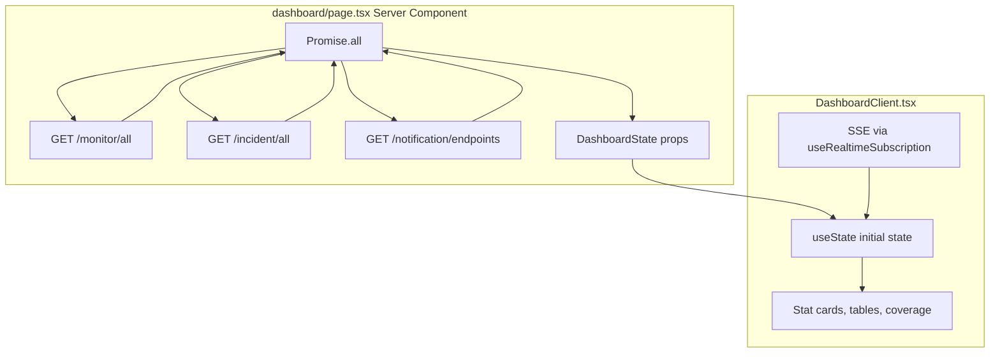

# Dashboard Real Data Integration

## The core answer

You **do not need a single backend "dashboard" API**. The dashboard is a **read-only overview** that combines data the backend already exposes on separate routes. The frontend aggregates it — exactly how [`notifications/page.tsx`](app/(signed)/notifications/page.tsx) already fetches two endpoints in parallel.



### APIs to call (all already used elsewhere)

| Dashboard section | Endpoint | Already used in |
|---|---|---|
| Monitor stats, health table, down alert | `GET /monitor/all` | [`monitor/page.tsx`](app/(signed)/monitor/page.tsx), [`notifications/page.tsx`](app/(signed)/notifications/page.tsx) |
| Open incidents, recent incidents table | `GET /incident/all` | [`incident/page.tsx`](app/(signed)/incident/page.tsx) |
| Endpoints, rules, coverage gap | `GET /notification/endpoints` | [`notifications/page.tsx`](app/(signed)/notifications/page.tsx) |

`GET /notification/endpoints` returns endpoints **with nested `rules[]`**, so a separate `GET /notification/rules` call is not needed for the dashboard.

---

## Recommended pattern (matches existing app conventions)

### 1. Server-side parallel fetch in `page.tsx`

Turn [`dashboard/page.tsx`](app/(signed)/dashboard/page.tsx) into an async Server Component and fetch all three resources at once:

```typescript
const [monitors, incidents, endpoints] = await Promise.all([
  apiFetch('/monitor/all'),
  apiFetch('/incident/all'),
  apiFetch('/notification/endpoints'),
]);
```

This runs all three requests concurrently (one round-trip wait instead of three sequential). Auth is handled automatically by [`lib/api.ts`](lib/api.ts) via the `token` cookie.

Pass the result to the client:

```typescript
<DashboardClient initialDashboardState={{ monitors, incidents, endpoints }} />
```

### 2. Add a `DashboardState` type

Create [`app/(signed)/dashboard/types.ts`](app/(signed)/dashboard/types.ts) (small file, mirrors `MonitorState` / `IncidentState` / `NotificationUIState`):

```typescript
import { Monitor } from "../monitor/types";
import { Incident } from "../incident/types";
import { NotificationEndpoint } from "../notifications/types";

export interface DashboardState {
  monitors: Monitor[];
  incidents: Incident[];
  endpoints: NotificationEndpoint[];
}
```

### 3. Refactor `DashboardClient` to accept props

In [`DashboardClient.tsx`](app/(signed)/dashboard/DashboardClient.tsx):

- Remove imports from [`mock-data.ts`](app/(signed)/dashboard/mock-data.ts)
- Accept `initialDashboardState: DashboardState`
- Initialize local state: `useState(initialDashboardState)`
- Change `resolveMonitorName` to look up from `state.monitors` (not module-level mock)
- **Keep all existing derived logic unchanged** — it already works on arrays:

```80:100:app/(signed)/dashboard/DashboardClient.tsx
const monitors = dashboardMonitors;
const incidents = dashboardIncidents;
const { endpoints } = dashboardNotifications;
// ... statusCounts, openIncidents, enabledRules, downMonitors
```

After the change, destructure from `state` instead of mock constants. No UI redesign needed.

### 4. Add realtime SSE (per your preference)

[`SignedLayout`](app/(signed)/layout.tsx) already wraps pages in `RealtimeProvider`, so the dashboard can reuse [`useRealtimeSubscription`](hooks/useRealtimeSubscription.ts) the same way [`MonitorClient`](app/(signed)/monitor/MonitorClient.tsx) and [`IncidentClient`](app/(signed)/incident/IncidentClient.tsx) do.

Handle the three event types the app already consumes:

| Event | Dashboard effect |
|---|---|
| `monitor.status` | Patch `monitors[].lastStatus` → updates stat cards, down alert, health table |
| `incident.created` | Prepend to `incidents` → updates open-incident count, recent table |
| `incident.resolved` | Patch matching incident `status` / `endedAt` → updates open count |

Copy the reducer logic from `MonitorClient` / `IncidentClient` into a single `useRealtimeSubscription` callback in `DashboardClient`. Notification endpoints have no SSE events today — they stay static until page refresh (acceptable; notifications page behaves the same).

### 5. Remove mock data

Delete or stop using [`mock-data.ts`](app/(signed)/dashboard/mock-data.ts) once real data is wired. No other file imports it except `DashboardClient`.

---

## What stays the same

- **No new backend endpoint** — aggregation is frontend-only
- **No changes to `apiFetch`** — reuse as-is
- **No changes to dashboard UI layout** — only data source changes
- **Notification coverage math** — already correct: `enabledRules`, `emailEndpoints`, monitors-without-rules all derive from `endpoints[].rules` + `monitors`

---

## Optional hardening (small, recommended)

- **Empty/error arrays**: `apiFetch` currently logs but does not throw on `!res.ok`. Defensively default to `[]` if the response is not an array, so a failed fetch does not crash the dashboard.
- **Loading state**: Not needed — Server Component blocks render until data arrives (same as monitor/incident/notifications pages). If you later add client-side refresh, add a skeleton then.

---

## Files to touch

| File | Change |
|---|---|
| [`app/(signed)/dashboard/page.tsx`](app/(signed)/dashboard/page.tsx) | Async server fetch with `Promise.all`, pass props |
| [`app/(signed)/dashboard/types.ts`](app/(signed)/dashboard/types.ts) | New `DashboardState` interface |
| [`app/(signed)/dashboard/DashboardClient.tsx`](app/(signed)/dashboard/DashboardClient.tsx) | Props + local state + SSE subscription |
| [`app/(signed)/dashboard/mock-data.ts`](app/(signed)/dashboard/mock-data.ts) | Delete (no longer needed) |

No changes to backend, `lib/api.ts`, or other pages.
