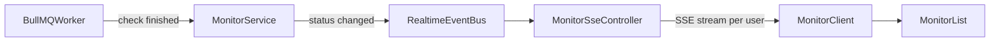

# Implement Realtime Monitor Status Updates (SSE)

## Goal
Make the monitor list update live when background checks complete, without requiring page refresh or manual actions.

## Current Frontend Baseline
- Initial monitor data is loaded server-side in [D:/fasterdev/uptime-monitor-fe/app/(signed)/monitor/page.tsx](D:/fasterdev/uptime-monitor-fe/app/(signed)/monitor/page.tsx).
- List rendering relies on local client state in [D:/fasterdev/uptime-monitor-fe/app/(signed)/monitor/MonitorClient.tsx](D:/fasterdev/uptime-monitor-fe/app/(signed)/monitor/MonitorClient.tsx) and [D:/fasterdev/uptime-monitor-fe/components/MonitorList.tsx](D:/fasterdev/uptime-monitor-fe/components/MonitorList.tsx).
- Current updates happen only through create/update/delete server actions in [D:/fasterdev/uptime-monitor-fe/app/(signed)/monitor/actions.ts](D:/fasterdev/uptime-monitor-fe/app/(signed)/monitor/actions.ts).

## Architecture

## Backend Plan (NestJS + BullMQ)
- Add a dedicated SSE endpoint, e.g. `GET /monitor/stream`, authenticated with your existing auth guard; resolve current user from request context.
- Maintain a per-user in-memory subscriber registry (`Map<userId, Subject<MonitorStatusEvent>>`) in a realtime service.
- In BullMQ processor (after each monitor check), publish a normalized event only for that monitor’s owner:
  - event shape: `{ type: "monitor.status.updated", monitorId, userId, lastStatus, checkedAt, latencyMs?, errorMessage? }`
- In SSE controller, stream:
  - `event: monitor.status.updated`
  - `data: <json-payload>`
- Add heartbeat events every ~20-30s to keep connections alive behind proxies.
- On connect, optionally emit a lightweight `snapshot` event (or force frontend to keep server-rendered initial state and only apply deltas).
- On disconnect, cleanly unsubscribe to prevent memory leaks.

## Frontend Plan (this repo)
- In [D:/fasterdev/uptime-monitor-fe/app/(signed)/monitor/MonitorClient.tsx](D:/fasterdev/uptime-monitor-fe/app/(signed)/monitor/MonitorClient.tsx):
  - Introduce local `monitors` state initialized from `state.monitors`.
  - Keep create/update/delete action flow, but merge action results into `monitors` state so manual CRUD and realtime updates use one source of truth.
  - Add `useEffect` SSE subscription using `EventSource` to `/monitor/stream`.
  - Parse `monitor.status.updated` events and patch only matching monitor row (`id === monitorId`) fields (`lastStatus`, optional metadata).
  - Handle reconnect behavior (`onerror`) with exponential backoff wrapper if native auto-retry is insufficient.
- In [D:/fasterdev/uptime-monitor-fe/components/MonitorList.tsx](D:/fasterdev/uptime-monitor-fe/components/MonitorList.tsx):
  - Accept monitor array prop from client-local source instead of directly reading stale action-state object.
  - Keep existing badge rendering; no UI redesign required.

## Data Contract
- Keep a shared DTO contract between backend and frontend for SSE payload.
- Frontend should safely ignore unknown event types for forward compatibility.
- Ensure `monitorId` is string-compatible with existing `Monitor.id` type in [D:/fasterdev/uptime-monitor-fe/app/(signed)/monitor/types.ts](D:/fasterdev/uptime-monitor-fe/app/(signed)/monitor/types.ts).

## Reliability and Security
- Restrict SSE stream to authenticated user context; never broadcast cross-user monitor updates.
- Add connection limits/cleanup strategy in NestJS realtime service.
- Log publish and subscribe lifecycle (connect/disconnect/event count) for debugging.

## Verification Plan
- Backend:
  - Trigger BullMQ check job manually and verify SSE event emission for correct user.
  - Validate no event leakage across user sessions.
- Frontend:
  - Open monitor page and confirm status badge changes without refresh.
  - Confirm create/update/delete still work while SSE stream is active.
  - Simulate backend restart/network drop and verify stream reconnect recovers updates.

## Rollout Steps
1. Ship backend SSE endpoint + publisher wiring from BullMQ results.
2. Add frontend SSE subscription and local monitor-state reducer.
3. Add heartbeat/reconnect hardening.
4. Validate in staging with multiple users and monitor churn.
5. Release and monitor stream error rates + stale-status complaints.