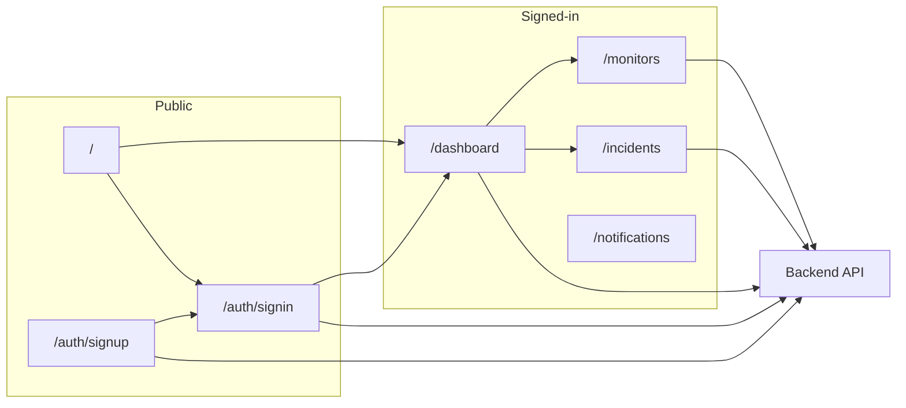

# Uptime Monitor Frontend Plan

## Current state

- **Stack**: Next.js 16 (App Router), React 19, Tailwind 4, Geist fonts. No API client or env yet. **Backend**: API doc provided (JWT auth, monitors, notifications; base URL localhost:8000). **UI**: Tailwind + shadcn/ui (to be installed).
- **Routes**: Root landing (`app/page.tsx`); auth at `auth/[mode]` (`app/auth/[mode]/page.tsx`); signed area with `app/(signed)/layout.tsx` wrapping Dashboard, Monitor, Incident (all stubs). Sidebar is a stub (`app/components/Sidebar.tsx`).
- **Gaps**: No backend integration, no auth protection, no real UI beyond placeholders.

---

## 1. API and environment

- **Env**: `NEXT_PUBLIC_API_BASE_URL` (e.g. `http://localhost:8000`). Add `.env.example` with placeholder; keep secrets out of repo.
- **Auth mechanism**: Backend expects **JWT in header** on protected routes: `Authorization: Bearer <access_token>`. Token is obtained from `POST /auth/login` only (signup does not return a token; user must log in after signup). There is no backend sign-out endpoint—frontend “sign out” = clear stored token and redirect to sign-in.
- **Token storage**: Store `access_token` so the app can send it on every request. Because middleware runs on the server, store the token in a **cookie** (e.g. `access_token`) after login so middleware can check presence and protect `/(signed)/`*. Use a short-lived cookie or same-site strict; set it from the client (or via a Next API route that proxies login and sets the cookie). Reading the token for API calls: from the cookie in server components/layouts, or from a client-side getter that reads the same cookie.
- **API layer** under `lib/`:
  - **Client**: shared `fetch` wrapper that adds `Authorization: Bearer <token>` (token from cookie or passed in), `Content-Type: application/json`, handles 401 (clear token, redirect to `/auth/signin`), and typed responses.
  - **Auth** (`lib/api/auth.ts`): `login({ email, password })` → `POST /auth/login`, returns `{ access_token }`; store token in cookie and return. `signup({ email, password, name })` → `POST /auth/signup` (201); no token. `signOut()` → clear cookie, redirect. No `/auth/me` in API; use JWT `sub` claim as `userId` for `GET /monitor/user/:userId` and when creating monitors.
  - **Monitors** (`lib/api/monitors.ts`): `getAll()`, `getByUser(userId)`, `getById(id)`, `getUptime(id, from, to)`, `getUptimeSummary(id)`, `create(payload)`, `update(id, payload)`, `delete(id)` — map to backend paths and Monitor type (id, name, url, method, interval, timeout, lastStatus, consecutiveFailures, consecutiveSuccesses, createdAt, userId).
  - **Notifications** (`lib/api/notifications.ts`): `createEndpoint({ channel, config })`, `createRule({ endpointId, monitorId?, events, enabled? })`, `getEndpoints()`, `getRules()` — map to backend. Channel: `EMAIL` | `SLACK` | `WEBHOOK`.
  - **Incidents**: API doc has no dedicated incidents list endpoint; `GET /monitor/:id/uptime` returns `incidentCount`. For “Incidents” UI, either show a placeholder for now or derive from monitor uptime/downtime data; add a proper incidents API integration when backend exposes it.
- **Types**: Add shared types (e.g. `lib/types.ts`) for Monitor, UptimeSummary, NotificationEndpoint, NotificationRule, and auth request/response shapes matching the API doc.
- Use **server-side** calls from Server Components where possible (dashboard, lists); **client-side** for login/signup forms, sign-out, and any interactive forms.

---

## 2. Authentication

- **Auth pages** (use existing `app/auth/[mode]/page.tsx`; mode = `signin` | `signup`):
  - **Sign-in**: Form with email (required, valid email) and password (required, 8–32 chars). Submit → `POST /auth/login` with `{ email, password }` → on success receive `{ status: "success", access_token }` → store token in cookie, redirect to `redirect` query param or `/dashboard`. Show validation/401 errors. Link to sign-up.
  - **Sign-up**: Form with email, password (8–32), name (required, 3–32), confirm password (client-side match). Submit → `POST /auth/signup` with `{ email, password, name }` → on 201 success redirect to `/auth/signin` (user must log in to get token). Handle 400 (e.g. user already exists). Link to sign-in.
  - **Sign-out**: No backend endpoint. Sidebar (and optional dedicated route) clears the auth cookie and redirects to `/auth/signin`.
- **Route protection**:
  - **Middleware** (project root `middleware.ts`): If path is under `/(signed)/`* and auth cookie is missing → redirect to `/auth/signin?redirect=<current path>`. If path is under `/auth/`* and auth cookie is present → redirect to `/dashboard` or `redirect` param. Use a single cookie (e.g. `access_token`) for presence check.
  - **Optional**: In (signed) layout, a Server Component or server action that verifies token (e.g. decode JWT) and redirects if invalid.
- **Landing** (`app/page.tsx`): If auth cookie present → redirect to `/dashboard`; else → redirect to `/auth/signin` (or minimal marketing page with “Sign in” CTA).

---

## 3. Dashboard (at a glance)

- **Purpose**: Single screen with key metrics and recent activity (Better Stack–style).
- **Data from API**:
  - **Monitors**: `GET /monitor/user/:userId` (userId from JWT `sub`) → list of monitors with `lastStatus` (`PENDING` | `UP` | `DOWN`).
  - **Uptime summaries**: For each monitor (or top N), `GET /monitor/:id/uptime/summary` → `{ last24hrs, last7days, last30days }` with `uptime` percentage.
  - **Incidents**: No dedicated list in API; `GET /monitor/:id/uptime` returns `incidentCount`. Dashboard can show “Total incidents (from monitors)” or a placeholder “Recent incidents” section until backend adds an incidents API.
- **Suggested content**:
  - **Summary cards**: Total monitors, count by status (up / down / pending) from monitor list; optional average or overall uptime from summaries.
  - **Monitors overview**: Compact list/table with name, URL, `lastStatus` (badge), last 24h/7d uptime from summary; link to Monitors page.
  - **Recent activity / Incidents**: Placeholder or derived from monitor status changes; link to Incidents page when data exists.
- **Layout**: Grid of cards (e.g. 2x2 or 3x1 for KPIs, then sections below). Use status colors: green = UP, red = DOWN, gray = PENDING. Use shadcn Card, Badge, Table where appropriate.
- **Data fetching**: Dashboard as Server Component; get token from cookie, decode for `userId`, then fetch monitors and uptime summaries server-side.

---

## 4. Sidebar and signed layout

- **Sidebar** (`[app/components/Sidebar.tsx](app/components/Sidebar.tsx)`):
  - **Layout**: Fixed (or sticky) left sidebar; main content in a `<main>` to the right with proper padding/max-width.
  - **Branding**: Logo or app name at top linking to `/dashboard`.
  - **Nav links**: Dashboard (`/dashboard`), Monitors (`/monitor` or `/monitors`), Incidents (`/incident` or `/incidents`), Notifications (e.g. `/notifications` — add route if not present). Use `usePathname()` and consistent pathnames to highlight active route.
  - **Bottom**: User email/name (if API returns it) and Sign out (button or link that calls sign-out API then redirects to sign-in).
- **Signed layout** (`app/(signed)/layout.tsx`):
  - Structure: wrapper (e.g. flex) with `<Sidebar />` and `<main className="...">{children}</main>` so all (signed) pages get sidebar + main area. Root layout does not render Sidebar; only (signed) uses it.
- **Responsive**: Optional collapsible sidebar (icon-only on small screens, expand on click) so the UI works on smaller viewports.

---

## 5. UI aesthetic and consistency (Tailwind + shadcn/ui)

- **Component library**: Use **shadcn/ui** with **Tailwind CSS** for consistent, accessible forms, buttons, cards, inputs, and tables. Install shadcn (e.g. `npx shadcn@latest init`), use dark theme, and add components as needed: Button, Input, Card, Badge, Table, Label, Form (for auth and CRUD). Keeps the app visually consistent and reduces custom CSS.
- **Theme**: Dark-first (Better Stack–like): dark background (e.g. `#0f0f0f` / `--background`), light text, subtle borders. Configure shadcn theme in `globals.css` and Tailwind to match; optionally respect `prefers-color-scheme` or force dark for the signed-in app.
- **Typography**: Keep Geist (already in root layout); use clear hierarchy (sans for headings, mono only for URLs/codes).
- **Status colors**: Semantic colors for monitor status: green = UP, red = DOWN, gray = PENDING. Define CSS variables (e.g. `--status-up`, `--status-down`) in `globals.css` and use them in Badge/cards so dashboard, monitor list, and sidebar stay consistent.
- **Polish**: Rounded corners, adequate padding and spacing, hover/focus states on nav and buttons for accessibility.

---

## 6. Pages and navigation

- **Monitors** (`app/(signed)/monitor/page.tsx`): List monitors via `GET /monitor/user/:userId`. Table or card list with name, url, method, interval, lastStatus, optional uptime summary; link to “Add monitor” (POST /monitor) and edit/delete (PATCH/DELETE) in a follow-up or same phase.
- **Incidents** (`app/(signed)/incident/page.tsx`): No incidents list in API yet. Show a placeholder (e.g. “Incident history will appear here when the backend exposes an incidents API”) and optional “incident count per monitor” from uptime data; link back to dashboard.
- **Notifications** (`app/(signed)/notifications/page.tsx`): Add route and sidebar link. List endpoints (`GET /notification/endpoints`) and rules (`GET /notification/rules`). UI to add endpoint (POST /notification/endpoint) and add rule (POST /notification/rule) with channel (EMAIL/SLACK/WEBHOOK), config, monitorId (optional), events (monitor.down, monitor.up).
- **Pathnames**: Use consistent routes: `/dashboard`, `/monitor` (or `/monitors`), `/incident` (or `/incidents`), `/notifications`; align sidebar `Link` hrefs and redirects.

---

## 7. Suggested implementation order

1. **Setup**: Env (`NEXT_PUBLIC_API_BASE_URL`), install and init shadcn/ui (dark theme), add status color variables to `globals.css`.
2. **API layer**: Shared fetch client (Bearer token from cookie, 401 → clear cookie + redirect), types (`lib/types.ts`), `lib/api/auth.ts`, `lib/api/monitors.ts`, `lib/api/notifications.ts`. Cookie helpers: set token on login, clear on sign-out, read in server/middleware.
3. **Auth**: Sign-in and sign-up forms (shadcn Input, Button, Label), token-in-cookie flow, middleware (protect `/(signed)/`*, redirect authed users from `/auth/`*), landing page redirect. Sign-out = clear cookie + redirect from sidebar.
4. **Layout**: (signed) layout with Sidebar + `<main>`, Sidebar with nav links (Dashboard, Monitors, Incidents, Notifications), active state (`usePathname`), Sign out button.
5. **Dashboard**: Server Component; get userId from JWT in cookie; fetch monitors and uptime summaries; summary cards (counts by status), monitors overview table/cards with status badges; optional “incidents” placeholder.
6. **Monitors page**: List from `GET /monitor/user/:userId`, table/cards with status; optional create form (POST /monitor).
7. **Incidents page**: Placeholder message; optional “by monitor” incident counts from uptime.
8. **Notifications page**: List endpoints and rules; forms to add endpoint and rule.
9. **Polish**: Status badges and colors everywhere, focus states, responsive sidebar if desired.

---

## 8. Optional diagram (app structure and data flow)

---

## API reference summary

- **Base URL**: `http://localhost:8000` (or `NEXT_PUBLIC_API_BASE_URL`).
- **Auth**: JWT in `Authorization: Bearer <access_token>`. Login: `POST /auth/login` (email, password) → `access_token`. Signup: `POST /auth/signup` (email, password, name) → then login. No sign-out endpoint; frontend clears token cookie.
- **Monitors**: `GET /monitor/user/:userId`, `GET /monitor/:id`, `GET /monitor/:id/uptime/summary`, `POST /monitor`, `PATCH /monitor/:id`, `DELETE /monitor/:id`. Model: id, name, url, method, interval, timeout, lastStatus (PENDING|UP|DOWN), userId, etc.
- **Notifications**: `POST /notification/endpoint`, `POST /notification/rule`, `GET /notification/endpoints`, `GET /notification/rules`. Channels: EMAIL, SLACK, WEBHOOK; events: monitor.down, monitor.up.
- **Incidents**: No list endpoint in doc; use `incidentCount` from `GET /monitor/:id/uptime` for now.

