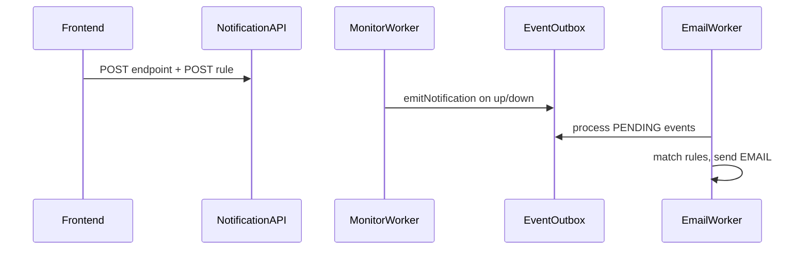

# Notification API — Frontend Integration Guide

This document describes the HTTP API for configuring uptime monitor notifications. Use it to build notification settings in the frontend app.

**Base URL (development):** `http://localhost:8000`  
**Controller prefix:** `/notification`  
There is no global API prefix on the server.

---

## Overview

Notifications use a two-step configuration model:

1. **Endpoint** — defines *where* alerts are sent (`channel` + channel-specific `config`).
2. **Rule** — defines *when* alerts are sent (which events, optional monitor scope, enabled flag).

Delivery is **server-side**. The frontend only creates and lists endpoints and rules. When a monitor goes up or down, the backend emits events, queues them in an outbox, and a background worker delivers matching notifications (email today).



### Current implementation limits

| Topic | Behavior |
|-------|----------|
| Channels | Only **EMAIL** is processed by the email worker. `SLACK` and `WEBHOOK` can be stored but are not delivered yet. |
| Outbox worker | The worker cron is commented out in code; outbox processing may not run automatically unless the cron is enabled or `process()` is triggered another way. |
| CRUD | There are **no** `PATCH` or `DELETE` routes for endpoints or rules. |
| Ownership checks | `endpointId` and `monitorId` are not validated for existence or ownership before create; invalid IDs may cause database errors. |

---

## Authentication

All notification routes require authentication via the global JWT guard.

| Detail | Value |
|--------|--------|
| Mechanism | JWT in **httpOnly cookie** named `token` |
| Set by | `POST /auth/login` (see Auth prerequisite below) |
| Frontend requirement | Send requests with `credentials: 'include'` |
| CORS (dev) | `origin: http://localhost:3000`, `credentials: true` |
| Missing/invalid token | `401 Unauthorized` |

Bearer tokens in the `Authorization` header are **not** used by the guard today (cookie only).

### Auth prerequisite

Before calling notification APIs, log in:

```http
POST /auth/login
Content-Type: application/json

{
  "email": "user@example.com",
  "password": "your-password"
}
```

On success, the server sets the `token` cookie. Subsequent notification requests must include credentials so the cookie is sent.

---

## Endpoints summary

| Method | Path | Description |
|--------|------|-------------|
| `POST` | `/notification/endpoint` | Create a notification endpoint |
| `POST` | `/notification/rule` | Create a notification rule |
| `GET` | `/notification/endpoints` | List endpoints (with nested rules) |
| `GET` | `/notification/rules` | List rules (with nested endpoint) |

**Headers for POST requests:** `Content-Type: application/json`

---

## POST `/notification/endpoint`

Registers a delivery channel for the authenticated user.

### Request body

| Field | Type | Required | Validation |
|-------|------|----------|------------|
| `channel` | string | Yes | One of: `EMAIL`, `SLACK`, `WEBHOOK` |
| `config` | object | Yes | Plain object; shape depends on `channel` |

### Channel `config` shapes

| `channel` | Expected `config` | Delivery status |
|-----------|-------------------|-----------------|
| `EMAIL` | `{ "email": "user@example.com" }` | Supported by email worker |
| `SLACK` | e.g. `{ "webhookUrl": "https://hooks.slack.com/services/..." }` | Stored only (not delivered yet) |
| `WEBHOOK` | e.g. `{ "webhookUrl": "https://your-app.com/hooks/alerts" }` | Stored only (not delivered yet) |

### Example request (EMAIL)

```json
{
  "channel": "EMAIL",
  "config": {
    "email": "alerts@example.com"
  }
}
```

### Example response `201` / `200`

Returns the created Prisma `NotificationEndpoint` record:

```json
{
  "id": "a1b2c3d4-e5f6-7890-abcd-ef1234567890",
  "userId": "user-uuid-from-jwt-sub",
  "channel": "EMAIL",
  "config": {
    "email": "alerts@example.com"
  },
  "createdAt": "2026-05-22T10:00:00.000Z"
}
```

### Errors

| Status | Cause |
|--------|--------|
| `400` | Validation failed (invalid `channel`, non-object `config`, etc.) |
| `401` | Not authenticated |

---

## POST `/notification/rule`

Links an endpoint to monitor events for the authenticated user.

### Request body

| Field | Type | Required | Validation |
|-------|------|----------|------------|
| `endpointId` | string | Yes | UUID of an existing endpoint (from create or list) |
| `monitorId` | string \| null | No | Omit or `null` = all monitors; set to scope to one monitor |
| `events` | string[] | Yes | Array of strings; each value must be `monitor.down` or `monitor.up` |
| `enabled` | boolean | No | Defaults to `true` if omitted |

### Event types

| Event string | Meaning |
|--------------|---------|
| `monitor.down` | Monitor transitioned to down (incident started) |
| `monitor.up` | Monitor recovered (incident resolved) |

These match backend `NotificationEventType` enum values.

### Example request (all monitors, both events)

```json
{
  "endpointId": "a1b2c3d4-e5f6-7890-abcd-ef1234567890",
  "events": ["monitor.down", "monitor.up"],
  "enabled": true
}
```

### Example request (single monitor, down only)

```json
{
  "endpointId": "a1b2c3d4-e5f6-7890-abcd-ef1234567890",
  "monitorId": "monitor-uuid-here",
  "events": ["monitor.down"],
  "enabled": true
}
```

### Example response

```json
{
  "id": "rule-uuid-here",
  "userId": "user-uuid-from-jwt-sub",
  "monitorId": null,
  "endpointId": "a1b2c3d4-e5f6-7890-abcd-ef1234567890",
  "events": ["monitor.down", "monitor.up"],
  "enabled": true,
  "createdAt": "2026-05-22T10:05:00.000Z"
}
```

### Errors

| Status | Cause |
|--------|--------|
| `400` | Validation failed (invalid `events`, missing `endpointId`, etc.) |
| `401` | Not authenticated |
| `500` / Prisma error | Invalid `endpointId` or foreign key violation (not explicitly handled) |

---

## GET `/notification/endpoints`

Returns all notification endpoints for the authenticated user, each including nested `rules`.

### Example response

```json
[
  {
    "id": "a1b2c3d4-e5f6-7890-abcd-ef1234567890",
    "userId": "user-uuid-from-jwt-sub",
    "channel": "EMAIL",
    "config": {
      "email": "alerts@example.com"
    },
    "createdAt": "2026-05-22T10:00:00.000Z",
    "rules": [
      {
        "id": "rule-uuid-here",
        "userId": "user-uuid-from-jwt-sub",
        "monitorId": null,
        "endpointId": "a1b2c3d4-e5f6-7890-abcd-ef1234567890",
        "events": ["monitor.down", "monitor.up"],
        "enabled": true,
        "createdAt": "2026-05-22T10:05:00.000Z"
      }
    ]
  }
]
```

### Errors

| Status | Cause |
|--------|--------|
| `401` | Not authenticated |

---

## GET `/notification/rules`

Returns all notification rules for the authenticated user, each including nested `endpoint`.

### Example response

```json
[
  {
    "id": "rule-uuid-here",
    "userId": "user-uuid-from-jwt-sub",
    "monitorId": "monitor-uuid-or-null",
    "endpointId": "a1b2c3d4-e5f6-7890-abcd-ef1234567890",
    "events": ["monitor.down"],
    "enabled": true,
    "createdAt": "2026-05-22T10:05:00.000Z",
    "endpoint": {
      "id": "a1b2c3d4-e5f6-7890-abcd-ef1234567890",
      "userId": "user-uuid-from-jwt-sub",
      "channel": "EMAIL",
      "config": {
        "email": "alerts@example.com"
      },
      "createdAt": "2026-05-22T10:00:00.000Z"
    }
  }
]
```

### Errors

| Status | Cause |
|--------|--------|
| `401` | Not authenticated |

---

## Frontend integration workflow

Recommended order for a notification settings UI:

1. **Authenticate** — `POST /auth/login` with `credentials: 'include'`.
2. **Load monitors (optional)** — If the user can scope rules per monitor, fetch monitor IDs. For example:
   - `GET /monitor/user/:userId` — monitors for a user
   - `GET /monitor/:id` — single monitor
3. **Create endpoint** — `POST /notification/endpoint`; store returned `id` as `endpointId`.
4. **Create rule(s)** — `POST /notification/rule` with chosen `events` and optional `monitorId`.
5. **Populate settings UI** — `GET /notification/endpoints` and/or `GET /notification/rules`.

You can create multiple endpoints (e.g. email + future Slack) and multiple rules (per monitor or global). Duplicate endpoints and rules are allowed.

---

## TypeScript types (optional)

```typescript
type NotificationChannel = 'EMAIL' | 'SLACK' | 'WEBHOOK';

type NotificationEventName = 'monitor.down' | 'monitor.up';

interface CreateNotificationEndpointBody {
  channel: NotificationChannel;
  config: Record<string, unknown>;
}

interface CreateNotificationRuleBody {
  endpointId: string;
  monitorId?: string | null;
  events: NotificationEventName[];
  enabled?: boolean;
}

interface NotificationEndpoint {
  id: string;
  userId: string;
  channel: NotificationChannel;
  config: Record<string, unknown>;
  createdAt: string;
  rules?: NotificationRule[];
}

interface NotificationRule {
  id: string;
  userId: string;
  monitorId: string | null;
  endpointId: string;
  events: NotificationEventName[];
  enabled: boolean;
  createdAt: string;
  endpoint?: NotificationEndpoint;
}
```

---

## Fetch examples

Assume `API_BASE = 'http://localhost:8000'` and the user is already logged in (cookie set).

### Create EMAIL endpoint

```typescript
const res = await fetch(`${API_BASE}/notification/endpoint`, {
  method: 'POST',
  credentials: 'include',
  headers: { 'Content-Type': 'application/json' },
  body: JSON.stringify({
    channel: 'EMAIL',
    config: { email: 'alerts@example.com' },
  }),
});
const endpoint = await res.json();
const endpointId = endpoint.id;
```

### Create rule for all monitors

```typescript
await fetch(`${API_BASE}/notification/rule`, {
  method: 'POST',
  credentials: 'include',
  headers: { 'Content-Type': 'application/json' },
  body: JSON.stringify({
    endpointId,
    events: ['monitor.down', 'monitor.up'],
    enabled: true,
  }),
});
```

### Create rule for one monitor

```typescript
await fetch(`${API_BASE}/notification/rule`, {
  method: 'POST',
  credentials: 'include',
  headers: { 'Content-Type': 'application/json' },
  body: JSON.stringify({
    endpointId,
    monitorId: 'your-monitor-uuid',
    events: ['monitor.down'],
  }),
});
```

### List endpoints and rules

```typescript
const [endpointsRes, rulesRes] = await Promise.all([
  fetch(`${API_BASE}/notification/endpoints`, { credentials: 'include' }),
  fetch(`${API_BASE}/notification/rules`, { credentials: 'include' }),
]);

const endpoints = await endpointsRes.json();
const rules = await rulesRes.json();
```

### Axios note

```typescript
import axios from 'axios';

axios.defaults.baseURL = API_BASE;
axios.defaults.withCredentials = true;

await axios.post('/notification/endpoint', {
  channel: 'EMAIL',
  config: { email: 'alerts@example.com' },
});
```

---

## Validation reference

NestJS `ValidationPipe` returns `400 Bad Request` with a message array when validation fails.

| Field / rule | Requirement |
|--------------|-------------|
| `channel` | Must be exactly `EMAIL`, `SLACK`, or `WEBHOOK` |
| `config` | Must be a JSON object |
| `endpointId` | Required string on rule create |
| `events` | Required array; each element must be `monitor.down` or `monitor.up` |
| `enabled` | Optional boolean |
| `monitorId` | Optional string (nullable) |

Example validation error shape (NestJS default):

```json
{
  "statusCode": 400,
  "message": [
    "events must contain only values: monitor.down, monitor.up",
    "channel must be one of the following values: EMAIL, SLACK, WEBHOOK"
  ],
  "error": "Bad Request"
}
```

Exact message text may vary slightly by NestJS/class-validator version.

---

## Caveats for integrators

- **User scoping:** List endpoints return only records where `userId` matches the JWT `sub` claim. Rules are filtered the same way.
- **No update/delete API:** To change config or disable a rule, you currently need backend support or manual DB changes; plan UI accordingly.
- **Rule matching (server):** At delivery time, rules match when: same `userId`, `enabled: true`, event type in `events`, `monitorId` equals payload monitor or is `null`, and endpoint `channel` is `EMAIL` for the email worker.
- **Duplicates:** Multiple endpoints with the same email or multiple rules for the same endpoint/monitor are allowed.
- **Internal APIs:** `emitNotification`, the event outbox, and workers are not exposed over HTTP; do not call them from the frontend.

---

## Related backend files

| File | Role |
|------|------|
| `src/notification/notification.controller.ts` | HTTP routes |
| `src/notification/notification.dto.ts` | Request validation |
| `src/notification/notification.service.ts` | Persistence |
| `src/notification/email-notification.worker.ts` | EMAIL delivery from outbox |
| `prisma/schema.prisma` | `NotificationEndpoint`, `NotificationRule` models |
| `src/shared/events/notification-event.types.ts` | Event type strings |
